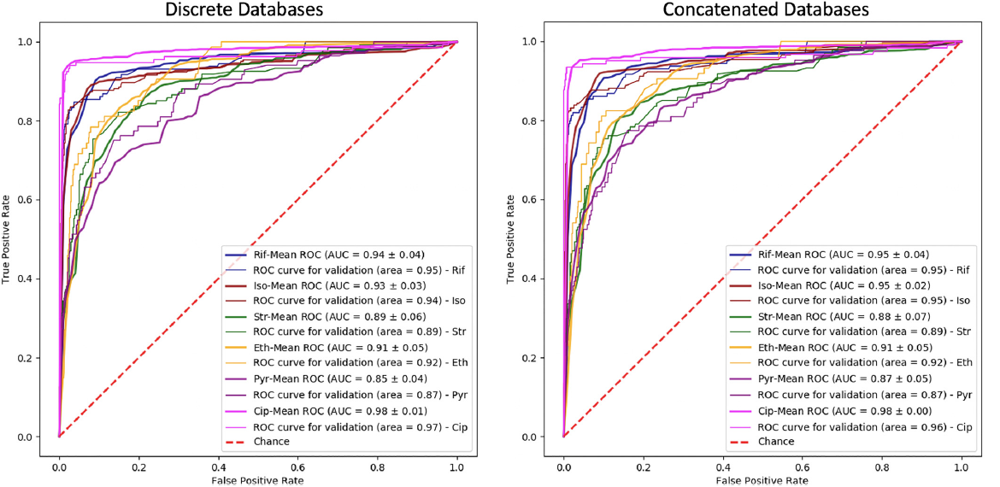
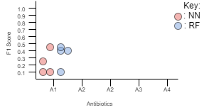

# MPGA
Mic Prediction using Gene Annotation

### More info
More information can be found under the manuscript directory within the README file.

# Figures

## Figure 1
The figure I will try to reproduce is:

Figure 1 is a [Receiver Operating Characteristic (ROC)](https://en.wikipedia.org/wiki/Receiver_operating_characteristic) plot. The plot tells how well an algorithm can predict for something when compared to chance (red dashed line). A perfect predictor would be one that has a line going up to (0.0, 1.0). In my case, I will still have 2 plots like what is shown, but my 2 plots will be for the Random Forest and Neural Network.

## Figure 2
The other figure I will try to reproduce:

Figure 2 is a symmetric jitter dot plot showing F1 scores for each Machine Learning algorithm over every antibiotic. [F1 scores](https://towardsdatascience.com/accuracy-precision-recall-or-f1-331fb37c5cb9) are another way to tell how well an algorithm can predict. Each point on the graph is an F1 score for a particular antibiotic/algorithm/MIC combination.

# Materials and methods

## Sequences
The gene sequences are collected and sequenced using Illumina sequencing at JMI Laboratories. The sequences are then run through an annotation pipeline that I have made to generate the annotations and annotated AA sequences.

## Preprocessing
### HGVS annotations
Convert annotation into a score using BLOSUM62 substitution matrix. Inserts and deletions are counted as 1 positon regardless of how many AA were inserted or delted. This would essentially be a list of scores for each bacterial isolate.

### AA sequences
Each position in the sequence is marked with:
* 1 - if a mutation occurred at that position in the sequence (inserts and deletions count as a single position)
* -1 - no mutation occurred at that position in the sequence

## Algorithms
There are two algorithms that will be used for prediction:
1. [Neural Network](https://towardsdatascience.com/understanding-neural-networks-19020b758230)
2. [Random Forest](https://towardsdatascience.com/understanding-random-forest-58381e0602d2)
3. [Gradient Boosted Forests](https://towardsdatascience.com/basic-ensemble-learning-random-forest-adaboost-gradient-boosting-step-by-step-explained-95d49d1e2725)

## Steps
1. Collect input data from JMI and Annotation pipeline
2. Preprocess that data as described above
3. Separate processed dataset into Training and Testing dataset
4. Train Neural Network and Random Forest separately on same Training dataset
5. Test both algorithms with the Testing dataset (capture predictions from this)
6. Create ROC plot and F1 scores from predictions and actual MICs used in previous step
7. Create final ROC plot (figure 1) and F1 scores plot (figure 2)
