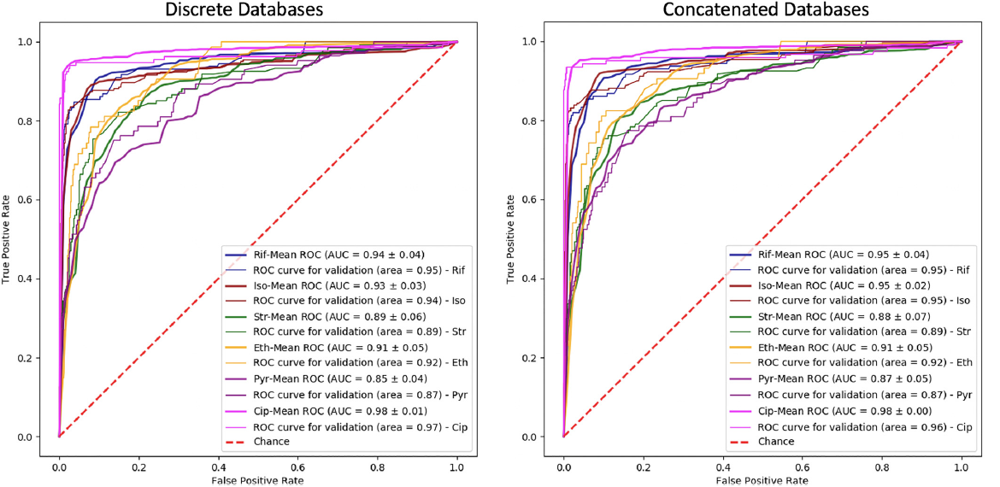
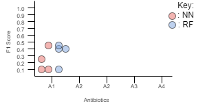
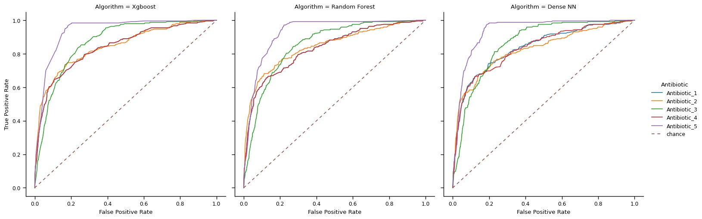
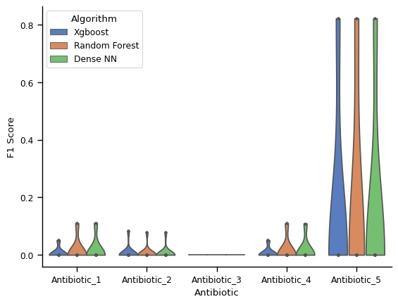

-- My own research

# Introduction
Currently, when a patient goes to a hospital with a bacterial infection, the patient will have the bacteria isolated, cultured, and colonies picked from the culture to be placed into multiple wells with growth media. Each well would have a unique concentration of an antibiotic. Multiple antibiotics can be tested together, but multiple antibiotics would not be placed into the same well. This process takes, on average, 72 hours to produce the [Minimum Inhibitory Concentration (MIC)](https://en.wikipedia.org/wiki/Minimum_inhibitory_concentration) value for the isolate (patient's isolated bacteria which could contain many bacterial cells) and a single antibiotic. That MIC value dictates how resistant or susceptible a bacterium is to a given antibiotic, and thus tells the physician whether a given antibiotic will be effective at clearing the bacteria from the patient. As time moves on, however, more resistant bacterial strains are becoming more prevalent, and more antibiotics are required to be tested before an adequate antibiotic may be found. There are many locations on the human body for bacterial infection, so each patient may be having a different outcome with their infection. Regardless of location of infection, and with more resistant strains of bacteria, antibiotics are taking longer to be given to that patient which makes the likelihood of death even more likely. This likelihood will continuously get higher until 2050 where it is predicted that bacterial infection will be the leading cause of death, replacing cancer, in the world [1]. That is why we must make the time to produce an MIC for a patient's bacteria, antibiotic pair, smaller. Machine Learning, along with [Next Generation Sequencing (NGS)](https://www.illumina.com/science/technology/next-generation-sequencing.html), can take this time down to one to two hours for numerous antibiotics at once. NGS would be able to collect the raw read data within an hour, the data could be sent through a sequencing pipeline within a few minutes, and finally the output from the pipeline could be sent as input to a Machine Learning algorithm to have any number of antibiotic MIC predictions within a minute.

# Data
The data used was annotated gene mutations (specifically Outer Membrane Protein (OMP) gene mutations) from Klebsiella Pneumoniae (KPN) bacteria to predict MIC values, given some five random, anonymous antibiotics. Reasoning behind using KPN is due to it being a Gram-negative species, and its efficiency of gaining bacterial resistance. Gram-negative bacteria are more likely to gain antibiotic resistance, and most antibiotic resistant bacteria known are Gram-negative [2]. The total number of isolates collected in this study was 2,864. Regarding antibiotic resistance, OMP genes may mutate to allow less antibiotic into the cell or expel more antibiotic once it enters the cell before the antibiotic has a chance to break the cell down. I did not look specifically for mutations that cause these changes. Instead, all mutations found for these genes are given to the algorithms. It is up to the algorithms to learn and find the mutations that help predict the MIC value accordingly.

## Collecting data
These mutations were collected from a pipeline that I built with JMI Laboratories which takes in a reference and raw read data, trims the read data, and does reference alignment between reference and trimmed read. Next, the pipeline finds [Single Nucleotide Polymorphisms (SNPs)](https://en.wikipedia.org/wiki/Single-nucleotide_polymorphism), insertions, deletions, and frameshifts and creates annotations from these mutations. The pipeline, then, creates an annotated Amino Acid (AA) sequence using the reference and annotations. Finally, it takes all isolates that were run, and the reference sequence, and performs a Multiple Sequence Alignment (MSA) so that all sequences match in length. This MSA is what the final output of the pipeline is for each gene reference used. Each of the 2,864 isolates have three AA sequences, each for the three OMP genes used, that were grouped together by gene.

## Processing
The preprocessed data had each AA converted to an index for that species' AA. For example, if we had a species that only has AAs A, B, and C, then their conversions would look like [A: 0, B: 1, C: 2]. That would mean an AA sequence "ACBCCA" would be converted into "021220"

# Algorithms
The three algorithms that were tested was [Neural Networks (NN)](https://towardsdatascience.com/understanding-neural-networks-19020b758230), [Random Forests (RF)](https://towardsdatascience.com/understanding-random-forest-58381e0602d2), and [Gradient Boosted Forests (GBF)](https://towardsdatascience.com/basic-ensemble-learning-random-forest-adaboost-gradient-boosting-step-by-step-explained-95d49d1e2725). For GBF, I used an algorithm called XGBoost. For XGBoost, the [XGBoost python library](https://xgboost.readthedocs.io/en/latest/python/python_intro.html) version 1.4.0 was used in the study. The RF algorithm came from the [Scikit-learn or Sklearn's](https://scikit-learn.org/stable/) [RandomForestClassifier class](https://scikit-learn.org/stable/modules/generated/sklearn.ensemble.RandomForestClassifier.html) with Sklearn's version being 0.24.1. The NN was built and trained using [Tensorflow-GPU](https://www.tensorflow.org/) and [Tensforflow-GPU's Keras package](https://keras.io/) with version 2.4.0.

## Neural Networks
The authors in D. Aytan-Aktug, et. al. [3] found that a one-hidden-layer NN worked best when they did their study, and that the NN was prone to overfitting due to its complexity. However, other studies [6, 7] have shown other NN structures that have worked in similar problem scenarios. In [6], a mix of multiple dense and drop-out layers were used while in [7] a Convolutional NN (CNN) was used. A CNN would not be advised here, as the authors in [7] made theirs due to having too many layers to start out. The authors in [7] only had four layers for each of the four nucleotides while here there are 25 different options that a position could be in a sequence (21 Amino Acids and four other characters). Because of the authors in D. Aytan-Aktug, et. al. [3] mentioning overfitting at one hidden layer, I first recreated their NN structure and trained a model. That model had roughly 53\% accuracy which is too low. Since the training and validation error were both low, that leads to the model not being able to learn the data well. From that, I changed to recreating the NN structure in [6]. This is the model that is used for the rest of the study, and it will be labeled as Dense NN.

# Training and Testing
When you train a Machine Learning algorithm, you obtain a model. A single algorithm can generate many different models depending on its input data, output prediction, the labels used to train, and parameters that make up the algorithm. The reasoning behind the inclusion labels can be thought of as follows, if you trained an algorithm to perform addition, for example, then gave it multiplication problems, it would fail. Even though both would have the same input and output, simple integers, the process to go from input to output has changed. That is why labels matter. Labels are used in training an algorithm. It tells the algorithm what is right after it tries to predict during training. The labels for addition may be 5 (for 3+2) and 6 (for 3+3). The labels for multiplication may be 6 (for 3\*2) and 9 (for 3\*3). The two different sets of labels would create two different models. One trained to predict addition and the other trained to predict multiplication. The same logic can be applied here. For the three algorithms mentioned previously, they will all be predicting MIC values. The labels, MICs, are different depending on antibiotic, so there will be a model trained for each antibiotic. If there would be three antibiotics, then there would be nine models total since we have three algorithms and three antibiotics.

In terms of splitting the dataset, 80% of the data will be made into the training dataset with the other 20% becoming the test dataset. When training a model, 5-fold Cross Validation will be performed. That means, out of the whole training dataset, 1/5 will be used to validate the model while the other 4/5 will be used to train the model.

# Hyperparameter Tuning
To give an algorithm the best chance at training a good model, you must give it proper hyperparameters. These hyperparameters are inputs given to the algorithms to guide the algorithm as it generates the model while training. Tuning these parameters can be done through a means called GridSearch [5] where you can think of the possible values for each hyperparameter coming together to form a grid and each point on the grid is a different model generated. In GridSearch, each model is generated in the grid and tested to give some performance value. Then, depending on the performance metric, you would maximize or minimize the models to get the best performing one. This model would then have the proper hyperparameters you would want to use to train with. This can be seen as a brute force optimization method, and as the number of hyperparameters grow, and number of possible values per hyperparameter grow, the number of models needing to be trained increases exponentially. This is where $2^k$ factorial design [4] comes in. This approach makes it so that you only use two values per hyperparameter, a low value and a high value. The setup is the same as GridSearch, and we can still use the GridSearch functions, but instead of finding the exact, best hyperparameters, we only need to get a general idea on whether larger values or smaller values work best per parameter. From there, you can choose around the best value to use. For GBF and RF, this approach was used to tune multiple hyperparameters each. A 10-fold Cross Validation was used with GridSearch to test each model, and the performance metric used was the average F1 score (F1-[micro](https://datascience.stackexchange.com/a/24051) score). GridSearch was also performed, as described above, for each antibiotic used. This would lead to a more generalized view for each hyperparameter as it looks at different labels (MICSs) from the different antibiotics. The results for these can be found in the `output\grid_search` folder as both plots and CSV output.

## XGBoost tuning
There were four [parameters that were tuned with XGBoost](https://xgboost.readthedocs.io/en/latest/parameter.html); subsample, max_depth, learning_rate, and colsample_bytree. It was determined that only max_depth plays a role here as it was the only hyperparameter to make a difference between training with a low or high value. All other hyperparameters had similar results when comparing their low and high outputs. The max_depth hyperparameter had gave better performance with the smallest value rather than the default. This would mean that it is easy to overfit the data as having a smaller value forces the trees in the forest to only pick a tiny number of genes to use before stopping.

## RF tuning
There were three [parameters that were tuned for RF](https://scikit-learn.org/stable/modules/generated/sklearn.ensemble.RandomForestClassifier.html); max_depth, min_samples_leaf, min_samples_split. Again, max_depth was the only hyperparameter whose value made a difference in the overall outcome of the model. However, in this case it seems that the max_depth variable varied on whether a small value or large value worked best across the antibiotics. For three antibiotics, a larger max_depth was better, for one a small max_depth was better, and, for the last antibiotic, both large and small performed about the same. Because, in general, a larger max_depth worked best, that is what was chosen.

# Figures to be Recreated
The figures will be generated by predicting the test dataset.

## Figure 1
The figure I will try to reproduce is:

Figure 1 is a [Receiver Operating Characteristic (ROC)](https://en.wikipedia.org/wiki/Receiver_operating_characteristic) plot. The plot tells how well an algorithm can predict for something when compared to chance (red dashed line). A perfect predictor would be one that has a line following the path from (0.0, 0.0) to (0.0, 1.0), then from (0.0, 1.0) to (1.0, 1.0). In my case, I will either have three separate plots, one for each algorithm, or I will have one plot with all algorithms being compared. It will depend on the number of antibiotics being used which may lead to too many lines in the plot if all algorithms were combined into one.

## Figure 2
The other figure I will try to reproduce:

Figure 2 is a symmetric jitter dot plot showing F1 scores for each Machine Learning algorithm over every antibiotic. [F1 scores](https://towardsdatascience.com/accuracy-precision-recall-or-f1-331fb37c5cb9) are another way to tell how well an algorithm can predict. Each point on the graph is an F1 score for a particular antibiotic/algorithm/MIC combination.

# Results
Figures 3 and 4 below show the results of the algorithms, after hyperparameter tuning. The ROC Curve in Figure 3 looks like Antibiotic 5 can be predicted quite well no matter which algorithm you chose. Antibiotics 1, 2, and 4 all perform about the same with a lot of False Positives, and Antibiotic 3 is in the middle. However, Figure 4 tells, a similar, but different story. Antibiotic 3's MIC values cannot be predicted by any algorithm with all F1 Scores being 0.00 for all MIC values in each algorithm. Antibiotics 1, 2, and 4 still perform about the same for all algorithms, but now we see that the high performance only comes from one MIC value. Each antibiotic can only predict one MIC value well no matter which algorithm you look at. When comparing the differences between the results in Figure 1, plot from [3], and Figure 3, Figure 1 shows both validation and test ROC curves while Figure 3 only shows test ROC curves. Looking at the different antibiotics given in the two graphs, Antibiotics 1, 2, and 4's ROC curves closely match the ROC curve of Pyr, worst performing antibiotic, in Figure 1. Antibiotic 5 closely matches Cip, best performing antibiotic, in Figure 1.

## Resulting Figures
These are the figures for the results, and these figures are the reproductions for the two figures given above. Both Figures 3 and 4 show that Antibiotic 5

### Figure 3

This Figure shows the ROC [micro-averaged](https://datascience.stackexchange.com/a/24051) Curves for each algorithm, antibiotic pair. Something to remember is that each algorithm, antibiotic pair is a separately trained model, so each line in this plot can be seen as the performance for a single model.

### Figure 4

This plot is the closest I could get to Figure 2. After plotting all the points, it was too difficult to make it all clean and readable, and you could easily put the MIC value next to each point. Because you could not place the MIC values, it was too difficult to understand that chart. The plot given above shows violin plots for the F1 Scores for each algorithm, antibiotic pair model. Each point in the violin plots is a different MIC value. The width of the individual violin plot tells how many MIC values are stacked at any given position.

# Conclusion
RF and NN do perform better overall than XGBoost. Each antibiotic has one MIC value that can be predicted much better than all other MIC values, and the algorithms can all predict that one MIC value roughly the same. Overall, the algorithms cannot predict MIC value for the given antibiotics.

# Future Research
Something that was never mentioned is how the data looks. If we look at the number of samples of each MIC value for the antibiotics, we see that the MIC values (classes) are skewed towards a particular value. This value is the one MIC for each antibiotic that is predicted well since it was the one that the algorithms most often saw. The study will be extended to see if these skewed sample sizes can be adjusted so that the MIC value counts can be about even. From there, hyperparameter tuning may need to be performed again and tests rerun. Once better results are achieved, you can view the feature importances (how importance each gene (feature) is) from what the XGBoost algorithm and RF algorithm say. Using whichever of the two algorithms performed best, you can get a sense of which genes/positions play important roles in having KPN be resistant against the tested antibiotics.

# References
1. M. Bassetti, G. Poulakou, E. Rupp´e, E. Bouza, S. J. V. Hal, and A. Brink,
“Antimicrobial resistance in the next 30 years, humankind, bugs and
drugs: a visionary approach.” Intensive Care Medicine, vol. 43, no. 10,
pp. 1464–1475, 2017.

2. Breijyeh, Z., Jubeh, B., & Karaman, R. (2020). Resistance of Gram-Negative Bacteria to Current Antibacterial Agents and Approaches to Resolve It. Molecules (Basel, Switzerland), 25(6), 1340. [https://doi.org/10.3390/molecules25061340](https://doi.org/10.3390/molecules25061340)

3. D. Aytan-Aktug, P. T. L. C. Clausen, V. Bortolaia, F. M. Aarestrup, and O. Lund. "Prediction of Acquired Antimicrobial Resistance for Multiple Bacterial Species Using Neural Networks". American Society for Microbiology Journals, January 5, 2020, e00774-19. [https://doi.org/10.1128/MSYSTEMS.00774-19](https://doi.org/10.1128/MSYSTEMS.00774-19).

4. Winer, B. J., Brown, D. R. & Michels, K. M. Statistical principles in experimental design, vol. 2 (McGraw-Hill New York, 1971).

5. Lerman, P. M. Fitting Segmented Regression Models by Grid Search. Journal of the Royal Statistical Society. Series C (Applied
Statistics) 29, 77–84 (1980).

6. Arango-Argoty, G., Garner, E., Pruden, A. et al. DeepARG: a deep learning approach for predicting antibiotic resistance genes from metagenomic data. Microbiome 6, 23 (2018). [https://doi.org/10.1186/s40168-018-0401-z](https://doi.org/10.1186/s40168-018-0401-z)

7. Zhou, J., Troyanskaya, O. Predicting effects of noncoding variants with deep learning–based sequence model. Nat Methods 12, 931–934 (2015). [https://doi.org/10.1038/nmeth.3547](https://doi.org/10.1038/nmeth.3547)

## Data
[JMI Laboratories](https://www.jmilabs.com/)

345 Beaver Kreek Center, Suite A, North Liberty, IA 52317

# Reflection
The biggest thing with reproducibility is that the data is not public. I tried describing what the data looks like well enough so someone can set up their own dataset that could be similar, but they cannot get the original dataset that I used. As for robustness, I can run the code multiple times with each time getting, roughly, the same result. This allows me to come back and rerun the code whenever I need to and understand what each thing does.

As for setup, going through this course made me set up my code in a much more thought out and proper structure. I usually would just randomly create scripts, folders to hold data, and folders to hold output files. Now, I make a structure and plan for the project before I start anything. In this case, I made the structure, the READMEs, and collected, and explained, the data before I created a single script. This should make it much easier in the future to come back and pick up where I left off.

A rather fun/interesting thing was that this was also the first project I have used seaborn and pandas in. In fact, this is the first project I have made all my graphs through code rather than excel. That made the reproducibility even better, and I thought it was so neat to see how in 1-3 lines I could have an extremely in depth, and tidy, graph made. I also loved how easy it was to work with, bring in, and export data using pandas. I never once had to use the `csv` python library and almost no for loops. All my data processing lines even extremely small with the largest being about 10 lines. I used to have my data processing be entire files that were over 200 lines each.

In all, even though it took me about 2-3 months to collect and start the project (in other words be extremely behind), using seaborn, pandas, the repo structure we learned, and Jupyter notebooks, I was able to get everything up in running within a few weeks which is record time for me (and it's actually readable!).